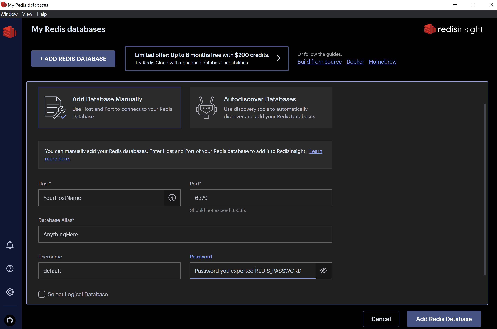
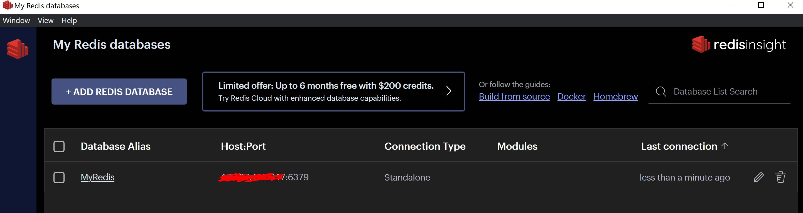
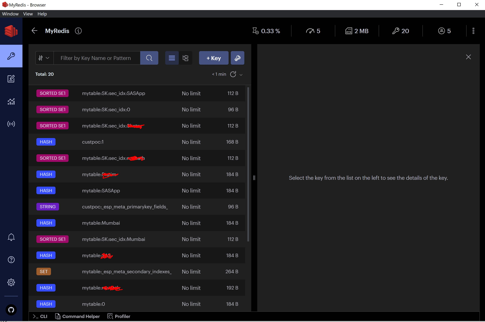

# Deploy Redis on open Source Kubernetes Cluster 

### Redis is an in-memory data structure store, used as a distributed, in-memory key–value database, cache and message broker, with optional durability. Redis supports different kinds of abstract data structures, such as strings, lists, maps, sets, sorted sets, HyperLogLogs, bitmaps, streams, and spatial indices.

#### Create redis namespace
```
kubectl create ns redis
```

#### Install Redis using help charts.
```
$ helm repo add bitnami https://charts.bitnami.com/bitnami
$ helm repo update
$ helm install redis-test -n redis --set persistence.storageClass=nfs-client,redis.replicas.persistence.storageClass=nfs-client bitnami/redis --set volumePermissions.enabled=true
NAME: redis-test
LAST DEPLOYED: Wed Jul 27 15:22:42 2022
NAMESPACE: redis
STATUS: deployed
REVISION: 1
TEST SUITE: None
NOTES:
CHART NAME: redis
CHART VERSION: 17.0.5
APP VERSION: 7.0.4

** Please be patient while the chart is being deployed **

Redis can be accessed on the following DNS names from within your cluster:

    redis-test-master.redis.svc.cluster.local for read/write operations (port 6379)
    redis-test-replicas.redis.svc.cluster.local for read-only operations (port 6379)

To get your password run:

    export REDIS_PASSWORD=$(kubectl get secret --namespace redis redis-test -o jsonpath="{.data.redis-password}" | base64 -d)

To connect to your Redis server:

1. Run a Redis pod that you can use as a client:

   kubectl run --namespace redis redis-client --restart='Never'  --env REDIS_PASSWORD=$REDIS_PASSWORD  --image docker.io/bitnami/redis:7.0.4-debian-11-r4 --command -- sleep infinity

   Use the following command to attach to the pod:

  kubectl exec --tty -i redis-client --namespace redis -- bash

2. Connect using the Redis CLI:
   REDISCLI_AUTH="$REDIS_PASSWORD redis-cli -h redis-test-master
   REDISCLI_AUTH="$REDIS_PASSWORD" redis-cli -h redis-test-replicas

To connect to your database from outside the cluster execute the following commands:

    kubectl port-forward --namespace redis svc/redis-test-master 6379:6379 --address='0.0.0.0' &
    REDISCLI_AUTH="$REDIS_PASSWORD" redis-cli -h <Your Host IP> -p 6379

```
#### Check if redis is deployed successfully and all pods are in running state
```
$ kubectl get pods -n redis
NAME                    READY   STATUS    RESTARTS   AGE
redis-client            1/1     Running   0          6d21h
redis-test-master-0     1/1     Running   0          6d21h
redis-test-replicas-0   1/1     Running   0          6d21h
redis-test-replicas-1   1/1     Running   0          6d21h
redis-test-replicas-2   1/1     Running   0          6d21h

$ kubectl get services -n redis
NAME                  TYPE        CLUSTER-IP      EXTERNAL-IP   PORT(S)    AGE
redis-test-headless   ClusterIP   None            <none>        6379/TCP   6d21h
redis-test-master     ClusterIP   10.104.68.229   <none>        6379/TCP   6d21h
redis-test-replicas   ClusterIP   10.97.4.138     <none>        6379/TCP   6d21h
```

### Test and validate Redis

```
$ kubectl port-forward --namespace redis svc/redis-test-master 6379:6379 --address='0.0.0.0' &
$ export REDIS_PASSWORD=$(kubectl get secret --namespace redis redis-test -o jsonpath="{.data.redis-password}" | base64 -d)
$ kubectl run --namespace redis redis-client --restart='Never'  --env REDIS_PASSWORD=$REDIS_PASSWORD  --image docker.io/bitnami/redis:7.0.4-debian-11-r4 --command -- sleep infinity
$ echo $REDIS_PASSWORD
$ kubectl exec --tty -i redis-client --namespace redis -- bash
  ---->>>> From within the redis-client shell run the following command
    
    I have no name!@redis-client:/$ REDISCLI_AUTH=ZGAbb1ZzRy redis-cli -h redis-test-master
    redis-test-master:6379> ping
    PONG
    redis-test-master:6379>
    redis-test-master:6379>ACL LIST
     1) "user default on #a742321c6ea24a687d5bb7773b38046da0bf1d2734ed72e54a4e39cbbadd4f71 ~* &* +@all"
     
```

### Testing Redis from Redis GUI - RedisInsight-V2

#### Creating Connection



#### Successfull Connection



#### Redis From Inside, who data looks like - I pushed some data by creating a table myTable



